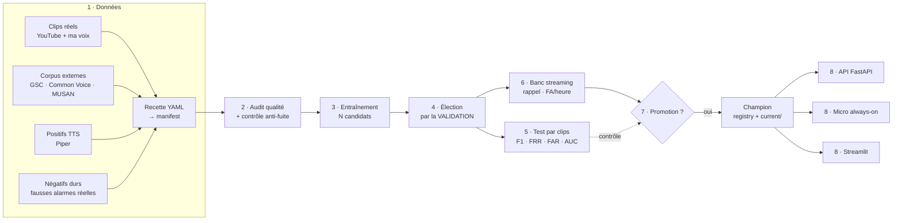

# Coach vocal — détection de wake word (pipeline MLOps)

Détecteur de mot-clé **always-on** : le micro écoute en permanence, un CNN binaire
décide 8 fois par seconde si le mot cible vient d'être prononcé. C'est la première
brique d'un coach vocal (réveil → enregistrement → transcription → agent).

Ce dépôt est la **version industrialisée** du travail exploratoire mené dans
`coach-vocal_etape1` : mêmes recettes, mêmes enseignements, mais pilotées par
configuration, tracées, testées et servies. L'ancien dépôt reste intact comme trace.

---

## Le pipeline



Deux évaluations, deux rôles : le **test par clips** est un garde-fou, le **banc
streaming** décide. Ce n'est pas une précaution théorique — le test par clips a
déjà classé premier un modèle qui s'est révélé dernier en conditions réelles.

---

## Démarrage

```bash
uv sync --all-groups                              # dépendances
uv run coachvocal experiments                     # ce qui est déclaré
uv run coachvocal train smoke                     # contrôle de bout en bout (~2 min)
```

Puis, pour un vrai run :

```bash
make data EXP=v03_replica     # manifest + contrôle anti-fuite
make audit EXP=v03_replica    # qualité des données AVANT d'entraîner
make train EXP=v03_replica    # 5 candidats, élection par la validation
make bench MINUTES=16         # conditions réelles
make dashboard                # preuve HTML consultable
uv run coachvocal registry promote v03_replica --reason "rappel 68.4 %, 52.7 FA/h au banc"
```

`make help` liste toutes les cibles.

---

## Principes de conception

| Principe | Concrètement | Pourquoi |
|---|---|---|
| **Rien en dur** | Tout hyperparamètre vit dans `configs/*.yaml` ; `--set training.epochs=5` pour un essai | Un run n'est plus une version de fichier : c'est une configuration, reproductible et diffable |
| **Front-end unique** | Un seul `log_mel()`, partagé entraînement / live / banc | Une divergence train-inférence produit un modèle qui « marche en test et rate en vrai », invisible dans les métriques |
| **Split figé** | `splits.csv` écrit une fois, par **groupe** (vidéo, session) | Re-tirer le split finit par sélectionner le tirage le plus flatteur ; splitter par clip fuit le locuteur |
| **Multi-candidats** | N seeds, élection **par la validation** | L'entraînement CPU n'est pas déterministe (±0.03-0.06 de F1) ; élire par le test serait un biais de sélection |
| **Le streaming décide** | Promotion sur `rappel` + `FA/heure` | Le test par clips a déjà mal classé les modèles |
| **Preuves regardables** | Chaque run produit PNG + rapport + dashboard HTML | Un JSON ne se conteste pas à l'œil ; une courbe, si |
| **Promotion tracée** | `CHAMPION.json` + lien `current/` | Le code d'inférence ne connaît qu'un chemin, jamais un numéro de run |

---

## Organisation

```
configs/       wakeword · dataset · model · experiment   ← toute la configuration
src/coachvocal/
  config.py    schémas pydantic + composition (`extends`)
  audio/       front-end log-mel (implémentation unique)
  data/        sources → manifest → tf.data · audit · corpus de vérité terrain
  models/      registre d'architectures (cnn_baseline, cnn_norm, dscnn)
  training/    protocole multi-candidats + sélection
  evaluation/  métriques par clip · banc streaming · figures · dashboard
  registry/    champion et historique des promotions
  inference/   machine à états partagée live/banc
  serving/     API FastAPI (Swagger sur /docs)
app/           interface Streamlit (5 pages)
tests/         pytest — ce qui doit rester vrai sans données
docs/          architecture · données · décisions (ADR) · journal · changelog
data/          hors git, versionné par DVC
artifacts/     runs, rapports, mlruns
```

## Services

```bash
make api        # http://127.0.0.1:8000/docs   API + Swagger
make ui         # http://127.0.0.1:8501        interface Streamlit
make mlflow     # http://127.0.0.1:5000        comparaison des runs
docker compose up api ui
```

## Documentation

- [`docs/ARCHITECTURE.md`](docs/ARCHITECTURE.md) — le pipeline étape par étape
- [`docs/DATA.md`](docs/DATA.md) — provenance et licence de chaque source
- [`docs/decisions/`](docs/decisions/) — décisions techniques et leurs raisons
- [`docs/JOURNAL.md`](docs/JOURNAL.md) — explorations, y compris les impasses
- [`docs/CHANGELOG.md`](docs/CHANGELOG.md) — historique des runs et des promotions

## Licence

Code sous licence [Apache 2.0](LICENSE). Les jeux de données ne sont pas
distribués dans ce dépôt ; leur provenance et leurs licences respectives sont
documentées dans [`docs/DATA.md`](docs/DATA.md).
