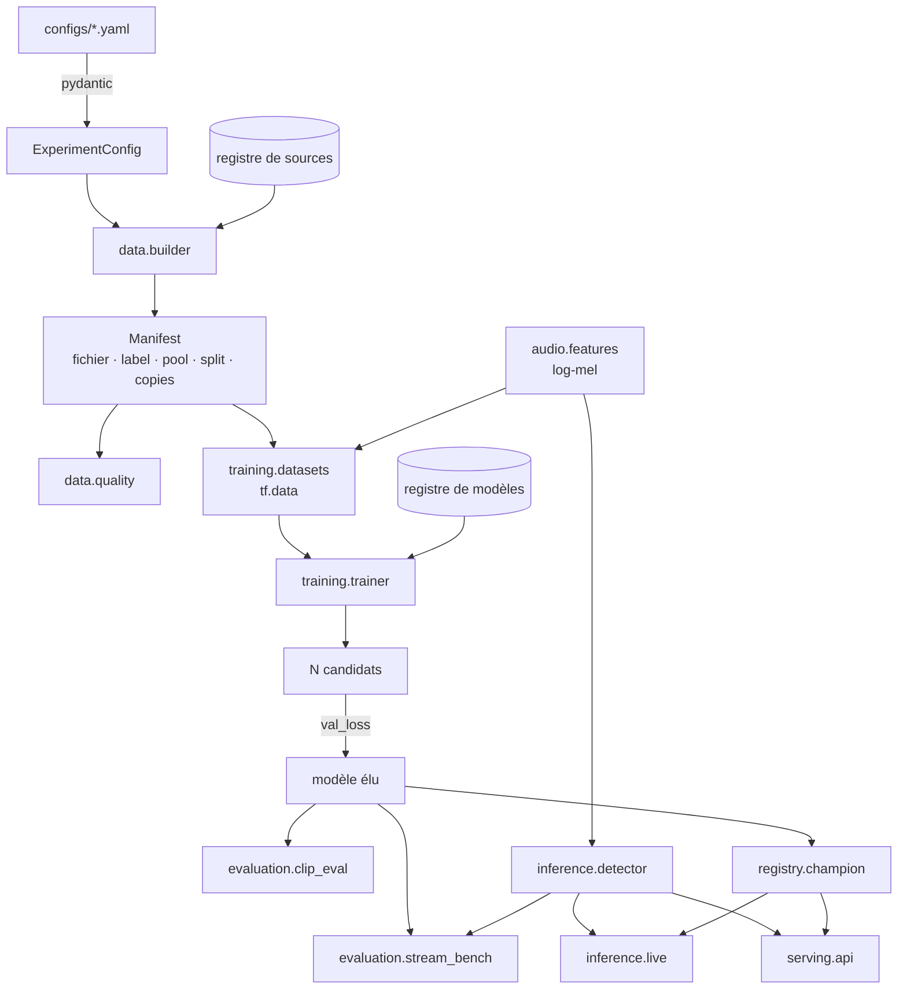

# Architecture

Document de référence : ce que fait chaque étape, ce qui s'y décide, et où
regarder quand un résultat surprend.

## Vue d'ensemble

Le point remarquable : `audio.features` et `inference.detector` alimentent **à la
fois** l'évaluation et la production. Il n'existe pas de « version d'entraînement »
et de « version live » du traitement du signal ou de la règle de décision.

---

## 1. Configuration (`config.py`)

Une expérience référence un mot-clé, une recette de dataset, une architecture, et
déclare son bloc d'entraînement. Trois mécanismes :

- **validation stricte** (`extra="forbid"`) : une clé mal orthographiée échoue au
  chargement, pas après vingt minutes de calcul ;
- **`extends`** : une recette hérite d'une autre et ne déclare que ses différences.
  Les listes de `sources` sont fusionnées **par nom** — sinon changer une dose
  obligerait à recopier douze sources ;
- **`--set a.b=c`** : surcharge ponctuelle, la commande complète restant
  reproductible telle quelle.

## 2. Données (`data/`)

Une **source** est une fonction décorée `@source("nom")` qui renvoie
`{split: [fichiers]}`. Elle est responsable de son propre split et doit être
idempotente. Ajouter un corpus ne demande aucune modification du pipeline.

Sources disponibles : `word_clips`, `guided`, `tts_piper`, `gsc`, `common_voice`,
`musan_noise`, `silence`, `fragments`, `speech_negatives`.

Le **manifest** est la liste exacte des fichiers avec leur pondération. Son
**empreinte** (hash indépendant de l'ordre) permet d'affirmer que deux runs ont vu
les mêmes données : un écart de métriques à empreinte identique est de la variance,
pas un progrès.

`check_leakage()` échoue si un même nom de fichier apparaît dans deux splits.

## 3. Front-end acoustique (`audio/features.py`)

`waveform 1 s → STFT → 40 filtres mel → log → z-score par exemple → (124, 40, 1)`.

Le z-score par exemple rend la représentation insensible au gain du micro : le
modèle apprend une forme spectrale, pas un niveau d'enregistrement.

## 4. Entraînement (`training/`)

Augmentations (train seulement) : vitesse ×0.85–1.15 puis décalage ±100 ms **non
circulaire**. `class_weight` corrige le déséquilibre (1 positif pour 20 à 40
négatifs), les `copies` du manifest pondèrent les sources rares.

Protocole : N candidats, élection par `val_loss`, test regardé une seule fois.
Les candidats sont conservés dans `runs/<id>/candidates/` — c'est ce qui permet
de reconstruire les artefacts finaux sans ré-entraîner (ce qui ne serait pas
reproductible à l'identique).

## 5. Évaluation

| | Test par clips | Banc streaming |
|---|---|---|
| Entrée | clips d'1 s pré-découpés | audio continu jamais vu |
| Vérité terrain | étiquettes du manifest | alignements WhisperX |
| Sortie | accuracy, F1, FRR, FAR, AUC | rappel, FA/heure |
| Rôle | **garde-fou** | **décision** |

Le banc rejoue la logique live exacte via `inference.detector`. Les événements dont
la vérité terrain est douteuse sont marqués « incertains » et **exclus** du
décompte : on préfère mesurer moins que mesurer faux.

## 6. Registre (`registry/`)

`CHAMPION.json` : run promu, date, raison chiffrée, historique. Lien `current/`
vers le dossier du champion. Tout le code d'inférence charge
`current/model.keras` — aucun numéro de run n'est écrit en dur.

## 7. Service (`serving/`, `inference/`, `app/`)

- `/predict` : probabilité maximale sur les fenêtres du fichier ;
- `/detect` : instants de réveil, machine à états complète ;
- `/models`, `/metrics` : registre et métriques (ce qu'affiche le dashboard) ;
- micro always-on et test guidé en CLI ;
- Streamlit : données, entraînement, évaluation, banc, démo.

---

## Où regarder quand un résultat surprend

| Symptôme | Première hypothèse | Vérification |
|---|---|---|
| Métriques trop belles | fuite train/test | empreinte du manifest, `check_leakage`, groupes de `splits.csv` |
| Bon en test, mauvais en vrai | test par clips non représentatif | `coachvocal bench` |
| Deux runs identiques divergent | non-déterminisme CPU | comparer les empreintes ; si égales, c'est de la variance |
| Loss qui explose | backend Metal | `use_gpu: false` (ADR-002) |
| Beaucoup de FA/heure | manque de négatifs de parole continue | recette `speech_neg` |
| Le mot est raté au tempo réel | augmentation de vitesse absente | `augmentation.speed_*` |
